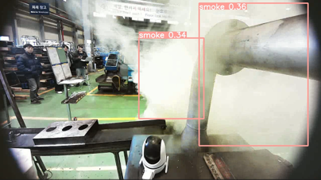
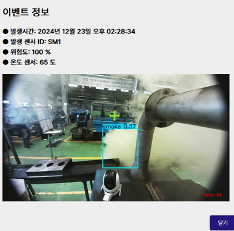

# 🔥 On-Device Real-Time Fire Detection System for Industrial Dust Collectors

> Real-time monitoring and early fire detection in industrial dust collector systems using edge AI and sensor fusion.

---

## 📖 Overview

This project presents an on-device fire detection system designed for **industrial dust collectors** in a **metal spring manufacturing facility**. The system utilizes **RGB cameras**, **temperature sensors**, and **Jetson-based edge AI** to detect early signs of fire such as smoke and abnormal temperature rises.

---

## ⚙️ Core Features

- 🔴 **Sensor Fusion Pipeline**
  - Real-time input from **RGB cameras** and **CT-1000N temperature sensors**
  - Data collected and streamed using **Kafka-Python**

- 🔍 **Fire Detection AI Models**
  - **YOLOv8** for object detection of smoke
  - **GMM (Gaussian Mixture Model)** for detecting temperature anomalies
  - **Soft voting** fusion strategy for final fire detection decision

- 🚀 **Edge Deployment**
  - **Jetson Orin Nano** executes detection on-device
  - Fire alert is triggered locally with minimal latency

---

## 🧪 Data Collection System

### ✅ Method Overview

| Source           | Description                                                               |
|------------------|---------------------------------------------------------------------------|
| Camera           | RGB video recorded using Jetson Nano (resolution: **640×480**)            |
| Temperature      | CT-1000N sensor logging every **1 second**                                |
| Storage Format   | `.avi` video files and `.csv` sensor logs                                 |
| Storage Schedule | Data saved in **10-minute segments**                                      |
| Save Location    | External storage mounted under `/media`                                   |

---

## 📸 Visual Examples

### 🔹 1. Smoke Detection with YOLOv8

  

Multiple bounding boxes for smoke with confidence scores.

---

### 🔹 2. On-Device Event Alert UI

  

- Shows detected **smoke**, **temperature**, **sensor ID**, **risk level**
- All inference runs **on-device** with Jetson Nano

---

## 🌡️ Sample Temperature Data

  

- Logs include `Timestamp`, `Object Temp`, and `Ambient Temp`  
- Used for anomaly detection with GMM

---

## 🗂️ Project Structure

rpi_kafka_utility
=================   

kafka_produce.py
-------------------
## produce_camera_stream(server_ip, server_port, topic_name)
### server_ip: your kafka server's ip (or hostname)
### server_port: your kafka server's port
### topic_name: your assigned kafka topic
kafka_consume.py
-----------------------
## consume_camera_stream(server_ip, server_port, topic_name, group_id)
### server_ip: your kafka server's ip (or hostname)
### server_port: your kafka server's port
### topic_name: your assigned kafka topic
### group_id: your consumer group id
    1. our topic consider only one partition because of ordering, you have to use different group id
    2. if not, you can't use partition since it is already occupied by other consumer in same group
## store_kafka_stream_as_video(server_ip, server_port, topic_name, group_id, o_width, o_height, timing="current", fps=60, video_len=60, save_dir=".", save_name="test_video", width=None, height=None, p_num_offset_dict=None)
### server_ip: your kafka server's ip (or hostname)
### server_port: your kafka server's port
### topic_name: your assigned kafka topic
### group_id: your consumer group id
### o_width, o_height: original frame's width, height
    These at below are optional parameters
### current: reset offset if you need ("latest" for end offset and "earliest" for start offset)
### fps: your wanted frame per second (fps)
### video_len: your wanted video length (time unit is second)
### save_dir, save_name: your file will be store in path 'save_dir/save_name'
### width, height: you can change your frame's from 'o_width * o_height' to 'width * height'
### p_num_offset_dict: if you want to start your frame from specific partition's offset frame, you can give the value as {partition_num: offset_num}
    You can customize these things
### fps and length of video
### video file's directory and name
### pixel size of video's frame
### which frame to start video
